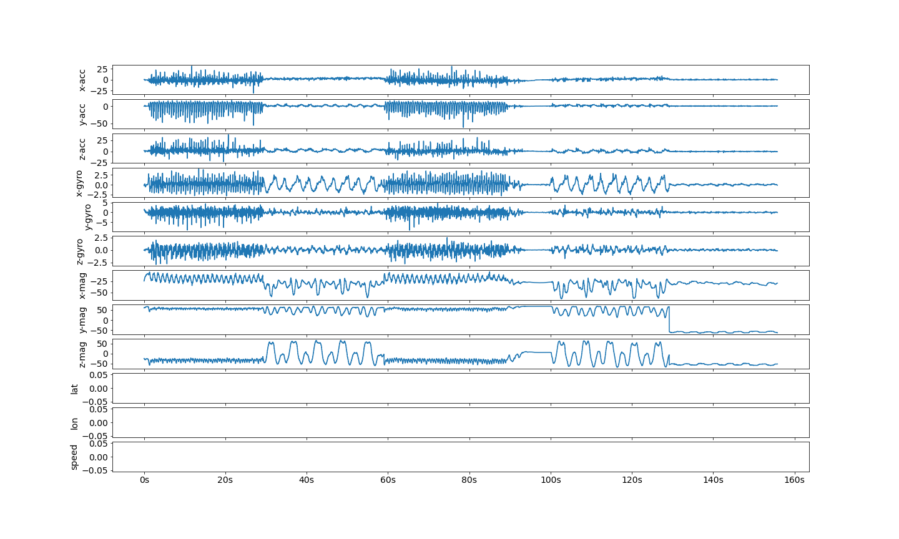
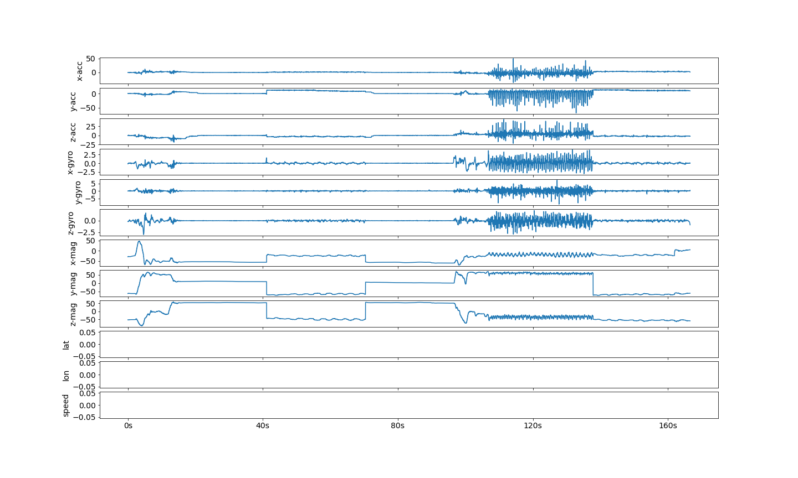
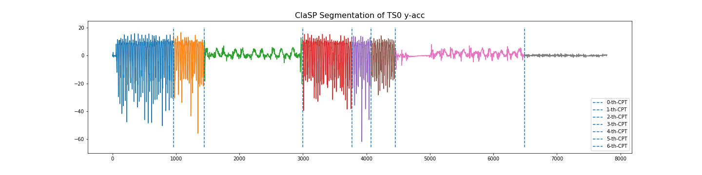
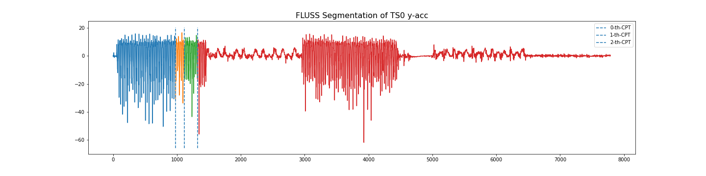
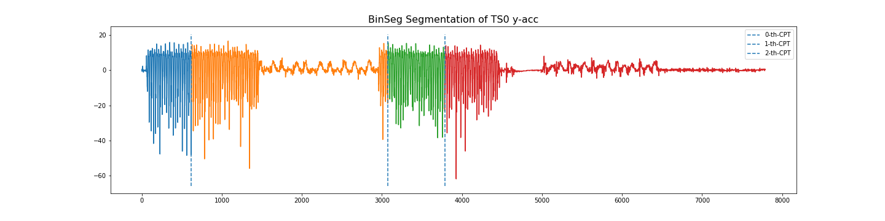

# ECML/PKDD 2023 Human Activity Segmentation Challenge

Time series segmentation (TSS) is a far too under-studied research field that plays a
crucial role in many real-world data analysis workflows for energy consumption, climate
change, or human activity recognition (HAR).

In a collaborative effort with 16 computer
science students, we collected and annotated real-world human motion sensor data. We
propose a TSS competition to partition the resulting 250 multi-variate TS into an a
priori unknown amount of variable-sized activities. This could greatly increase the
accuracy of HAR systems and would promote benchmarking in TSS.

This repository contains supporting materials, including the data set, Python data
loaders and baselines for the challenge. The folder `notebooks` contains
Jupyter notebooks to run the baselines on the challenge data. The challenge data set is
stored in the `datasets` folder.

## Organization and Registration

This competition is hosted by the <a href="https://2023.ecmlpkdd.org/submissions/discovery-challenge/challenges/" target="_blank">ECML/PKDD 2023 conference</a> as a *Discovery Challenge*. It is organized using the Kaggle platform starting 11th April and ending 11th June. The results and top three winning solutions will be presented at the AALTD workshop in September, 2023. 

**Please fill out this <a href="https://docs.google.com/forms/d/1BoAJWlhCVU0LUeDLzb7GOBM4MTk2AKkfpY--hk987-0" target="_blank">google form</a> to register for the challenge. Upon registration, we will send you the invitation link to the Kaggle competition website via mail. Participants are strictly prohibited from registering multiple times to gain an unfair advantage. No pseudonyms may be used for registration.**

# Prerequisites

In order to run the baselines, you have to install the packages from `requirements.txt`.

`pip install -r requirements.txt`

You will need to install the following packages with segmentation algorithms to run all baselines:

`aeon==0.1.0rc0`, `claspy`, `ruptures`, `stumpy`

# Human Activity Data

We collected a data set of 250 annotated twelve-dimensional multivariate TS, for a total
of 10.7 hours, sampled at 50 Hertz (Hz). These TS contain between seven seconds and
fourteen minutes - the median is median 100 seconds - of human motion data, capturing
one to fifteen potentially recurring activities from a total of one hundred different 
ones, each lasting from half a second (for waiting) to ten minutes (for running). The 
data in this repository does not contain any labels. You may explore the data with the
provided `exploration.ipynb` notebook.

## Examples

The following two images show examples of the first two time series in the data set.





## Baselines

We provide code for six baseline codes in the `notebooks folder:

- Binary-Segmentation from ruptures
- ClaSP from claspy
- FLUSS from stumpy
- GreedyGaussianSegmentation (GGS) from aeon
- InformationGainSegmentation (IGTS) from aeon
- STRAY from aeon

## Segmentations

If we run ClaSP, FLUSS and BinSeg baselines on the y-axis acceleration channel of
TS0, we get the following segmentation.





## Citation

If you use the challenge data in your publication, please us cite as:
```
@misc{segmentation_challenge,
	author = {Ermshaus, Arik, and Sch{\"a}fer, Patrick, and Leser, Ulf and  Bagnall, Anthony and Tavenard, Romain and Leverger, Colin and Lemaire, Vincent and Malinowski, Simon and Guyet, Thomas and Ifrim, Georgiana},
	howpublished = {ECML/PKDD 2023 Discovery Challenge},
	title = {Human Activity Segmentation Challenge},
	month = {April},
	year = {2023}
}
```

## Powered By

1. [tslearn](https://tslearn.readthedocs.io/)
2. [aeon](https://www.aeon-toolkit.org/)
