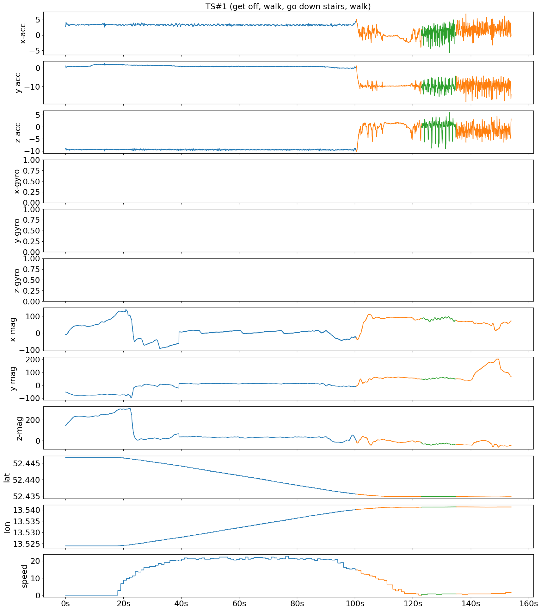
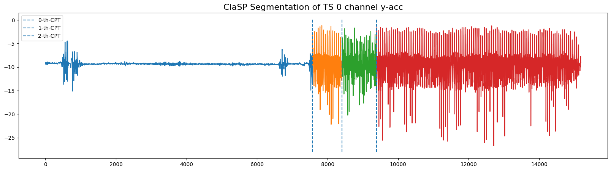
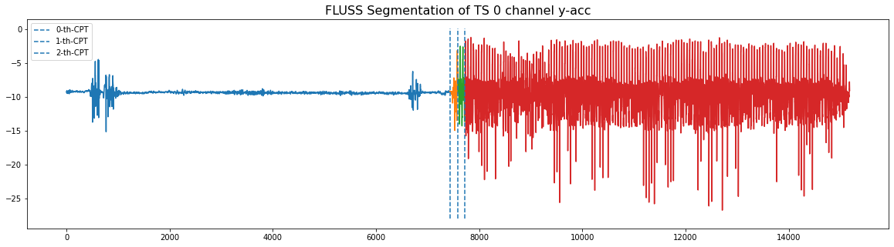
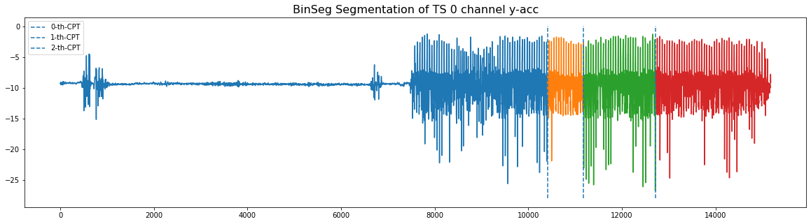

# ECML/PKDD 2023 Human Activity Segmentation Challenge Proposal Baselines

Time series segmentation (TSS) is a far too under-studied research field that plays a crucial role in many real-world data analysis workflows for energy consumption, climate change, or human activity recognition (HAR). In a collaborative effort with 16 bachelor computer science students, we collected and annotated real-world human motion sensor data. We propose a TSS competition to partition the resulting 250 multi-variate TS into an a priori unknown amount of variable-sized activities. This could greatly increase the accuracy of HAR systems and would promote benchmarking in TSS.

This repository contains supporting materials, including data, Python loaders and baselines for the challenge. The folder `notebooks` contains Jupyter-Notebooks to run the baselines on the challenge data. The challenge data set is stored in the `datasets` folder.

# Prerequisites

In order to run the baselines, you will have to install the packages from the `requirements.txt` file.

`pip install -r requirements.txt`

# Human Activity Data

We collected a data set of 250 annotated twelve-dimensional multivariate TS (a total of 10.7 hours), sampled at 50 Hertz (Hz). These TS contain between seven seconds and fourteen minutes (median 100 seconds) of human motion data, capturing one to fifteen potentially recurring activities from a total of one hundred different ones, each lasting from half a second (for waiting) to ten minutes (for running). The data in this repository does not contain any labels. You can explore the data with the provided `exploration.ipynb` notebook.

## Examples

The following two images show examples of the first two time series in the data set.

If we run the ClaSP, FLUSS and BinSeg baselines on the y-axis acceleration channel of TS0, we get the following segmentation.

