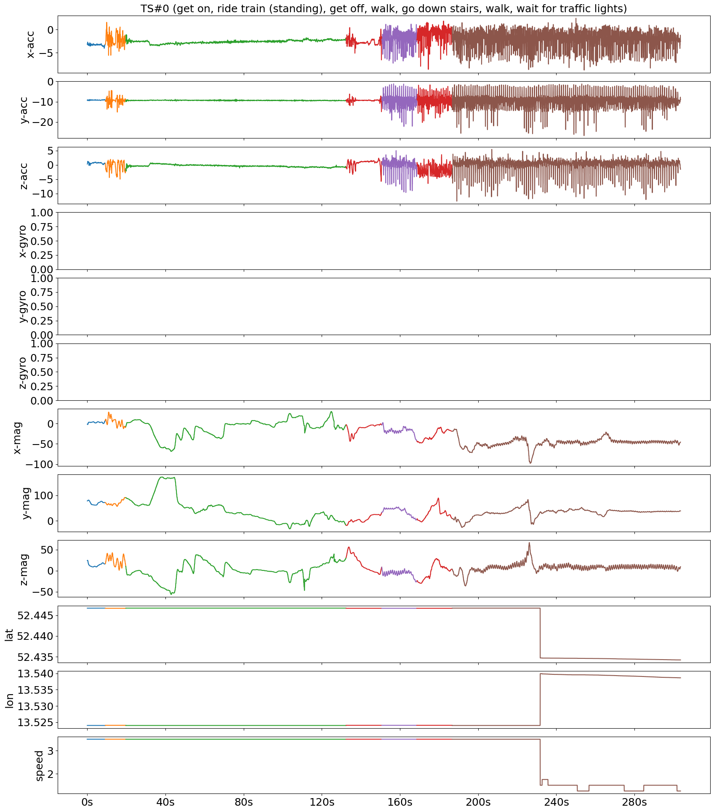

# Human Activity Segmentation Challenge @ ECML/PKDD'23

Time series segmentation (TSS) is a far too under-studied research field that plays a
crucial role in many real-world data analysis workflows for energy consumption, climate
change, or human activity recognition (HAR).

In a collaborative effort with 15 computer
science students, we collected and annotated real-world human motion sensor data. We
propose a TSS competition to partition the resulting 250 multi-variate TS into an a
priori unknown amount of variable-sized activities. This could greatly increase the
accuracy of HAR systems and would promote benchmarking in TSS.

This repository contains supporting materials, including the data set, Python data
loaders and baselines for the challenge. The folder `notebooks` contains
Jupyter notebooks to run the baselines on the challenge data. The labelled challenge data set is
now available and stored in the `datasets` folder. This <a href="https://github.com/patrickzib/human_activity_segmentation_challenge/blob/main/notebooks/data_exploration.ipynb">notebook</a> explores the data.

## Organization and Registration

This competition was hosted by the <a href="https://2023.ecmlpkdd.org/submissions/discovery-challenge/challenges/" target="_blank">ECML/PKDD 2023 conference</a> as a *Discovery Challenge*. It was organized using the Kaggle platform starting 11th April and ending 11th June. The results and top-2 winning solutions were presented at the AALTD workshop in September, 2023. This challenge has ended. We provide a summary of its organization and results in this <a href="https://ecml-aaltd.github.io/aaltd2023/papers/has_challenge_ecml.pdf">paper</a>. 

<!--
**Please fill out this <a href="https://docs.google.com/forms/d/1BoAJWlhCVU0LUeDLzb7GOBM4MTk2AKkfpY--hk987-0" target="_blank">google form</a> to register for the challenge. Upon registration, we will send you the invitation link to the Kaggle competition website via mail. Participants are strictly prohibited from registering multiple times to gain an unfair advantage. No pseudonyms may be used for registration.**
-->

# Prerequisites

In order to run the baselines, you have to install the packages from `requirements.txt`.

`pip install -r requirements.txt`

You will need to install the following packages with segmentation algorithms to run all baselines:

`aeon==0.1.0rc0`, `claspy`, `ruptures`, `stumpy`

# Human Activity Data

We collected a data set of 250 annotated twelve-dimensional multivariate TS, for a total
of 10.7 hours, sampled at 50 Hertz (Hz). These TS contain between seven seconds and
fourteen minutes - the median is median 100 seconds - of human motion data, capturing
one to fifteen potentially recurring activities from a total of one hundred different 
ones, each lasting from half a second (for waiting) to ten minutes (for running). The 
data in this repository does not contain any labels. You may explore the data with the
provided `exploration.ipynb` notebook.

## Examples

The following two images show examples of the first two time series in the challenge data set.




## Baselines

We provide code for six baseline codes in the `notebooks` folder:

- Binary-Segmentation from ruptures
- ClaSP from claspy
- FLUSS from stumpy
- GreedyGaussianSegmentation (GGS) from aeon
- InformationGainSegmentation (IGTS) from aeon
- STRAY from aeon

## Segmentations

If we run ClaSP, FLUSS and BinSeg baselines on the y-axis acceleration channel of
TS0, we get the following segmentation.


## Citation

If you use the challenge data in your publication, please cite us as:
```
@inproceedings{segmentation_challenge,
	title={Human Activity Segmentation Challenge @ ECML/PKDD’23},
	author={Arik Ermshaus and Patrick Sch{\"a}fer and Anthony Bagnall and Thomas Guyet and Georgiana Ifrim and Vincent Lemaire and Ulf Leser and Colin Leverger and Simon Malinowski},
	booktitle={8th Workshop on Advanced Analytics and Learning on Temporal Data},
	year = {2023}
}
```

## Powered By

1. [tslearn](https://tslearn.readthedocs.io/)
2. [aeon](https://www.aeon-toolkit.org/)

<a rel="license" href="http://creativecommons.org/licenses/by-nc-sa/4.0/"></a><br />This work is licensed under a <a rel="license" href="http://creativecommons.org/licenses/by-nc-sa/4.0/">Creative Commons Attribution-NonCommercial-ShareAlike 4.0 International License</a>.
